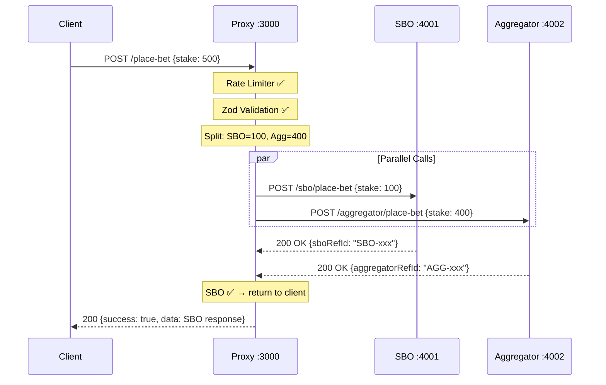
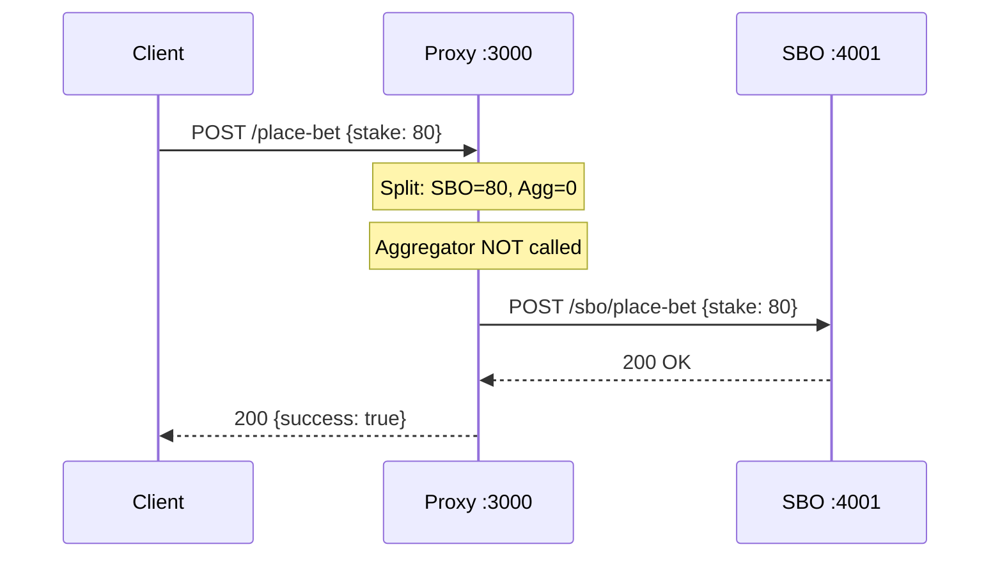
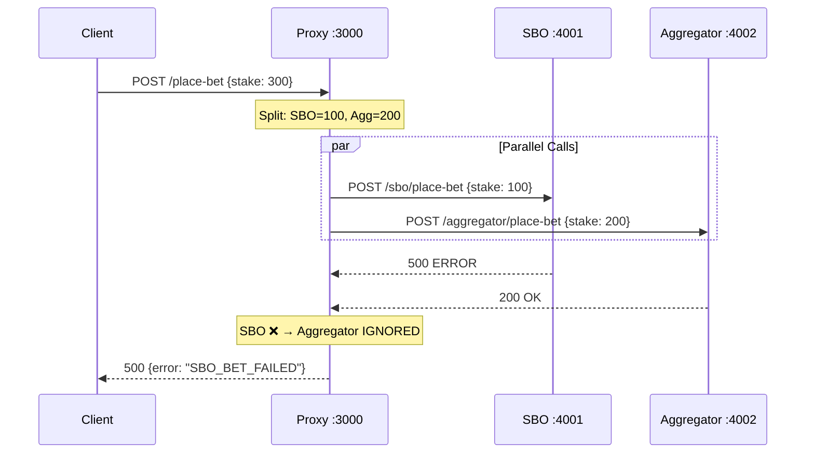
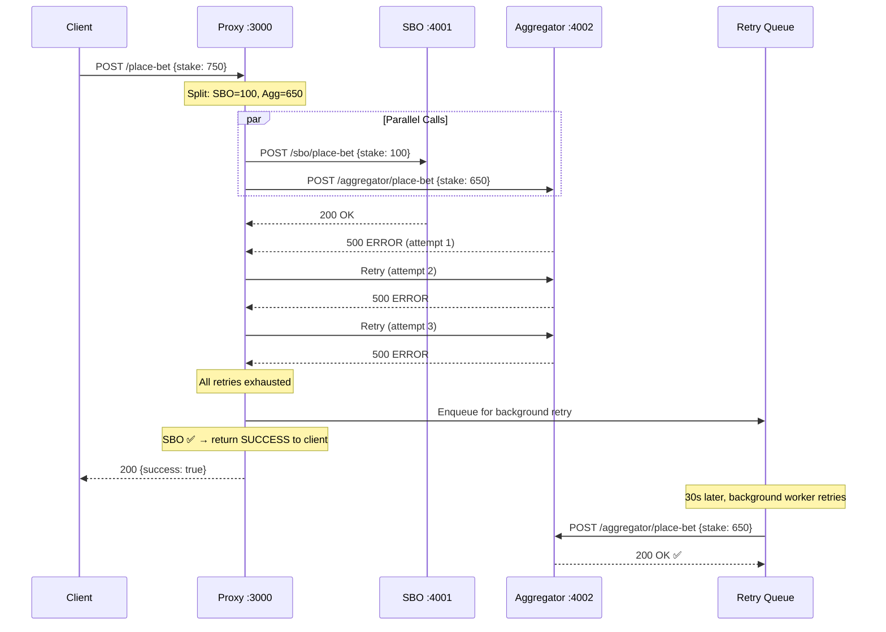
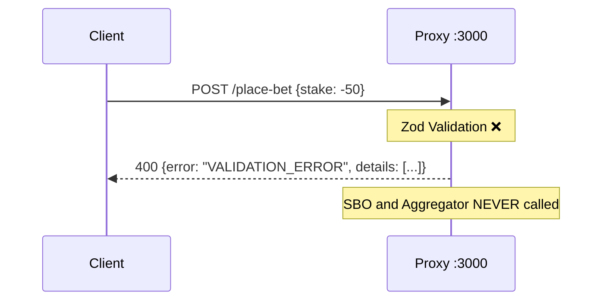
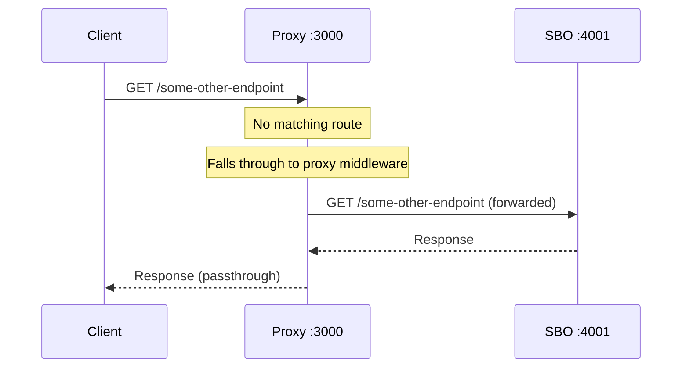

# 🎰 Bet-Split Proxy — Complete Project Walkthrough

> Every file, every flow, and how to verify it all works.

---

## 📁 Project Structure & File Roles

```
Bet-assign/
├── .env                          ← Runtime config (ports, stakes, retries)
├── .env.example                  ← Template for new developers
├── .gitignore                    ← Excludes node_modules, logs, .env
├── package.json                  ← Dependencies + all npm scripts
├── README.md                     ← Quick-start documentation
│
└── src/
    ├── index.js                  ← 🟢 ENTRY POINT — wires everything together
    │
    ├── config/
    │   └── index.js              ← Reads .env, exports one config object
    │
    ├── controllers/
    │   └── betController.js      ← 🧠 BRAIN — orchestrates split → fan-out → respond
    │
    ├── middleware/
    │   ├── proxyMiddleware.js     ← Reverse proxy for non-bet routes
    │   ├── rateLimiter.js         ← Throttles requests per IP
    │   └── requestValidator.js   ← Zod schema validation
    │
    ├── services/
    │   ├── betSplitter.js        ← Pure math: splits stake into SBO + Aggregator
    │   ├── sboService.js         ← HTTP client for SBO API (no retries)
    │   ├── aggregatorService.js  ← HTTP client for Aggregator (with retries)
    │   └── retryQueue.js         ← Background queue for failed Aggregator bets
    │
    ├── utils/
    │   └── logger.js             ← Winston structured logging
    │
    ├── mock/
    │   ├── sboServer.js          ← Fake SBO API (port 4001)
    │   └── aggregatorServer.js   ← Fake Aggregator API (port 4002)
    │
    └── demo/
        ├── testSuccess.js        ← Test: happy path
        ├── testSboFail.js        ← Test: SBO failure
        ├── testAggregatorFail.js ← Test: Aggregator failure
        ├── testValidation.js     ← Test: bad payloads
        └── runAll.js             ← Runs all 4 tests sequentially
```

---

## 🔍 What Each File Does (Detailed)

### Root Files

| File | Role |
|---|---|
| [.env](file:///c:/Users/komal/Desktop/Bet-assign/.env) | **Runtime configuration.** All tuneable values — ports, MIN_STAKE, retry counts, proxy credentials. Loaded by `dotenv`. |
| [package.json](file:///c:/Users/komal/Desktop/Bet-assign/package.json) | **Project manifest.** Defines dependencies (express, axios, zod, winston, etc.) and all npm scripts (start, dev, demo, test:\*). |

### `src/config/index.js` — Configuration Hub

[View file](file:///c:/Users/komal/Desktop/Bet-assign/src/config/index.js)

- Reads **every `.env` variable** using `dotenv`
- Parses them to correct types (parseInt, parseFloat)
- Provides **sensible defaults** so the app works even without a `.env` file
- Exports a single `config` object used everywhere

```js
// Example: other files just do
const config = require('../config');
console.log(config.minStake); // 100
```

### `src/index.js` — Application Entry Point

[View file](file:///c:/Users/komal/Desktop/Bet-assign/src/index.js)

**This is the master wiring file.** It creates the Express app and layers everything in order:

```
1. express.json()           → Parse incoming JSON bodies
2. Request logger           → Log every incoming request
3. Routes (/place-bet, /health) → Handled explicitly by our code
4. Reverse Proxy            → Everything else forwarded to upstream SBO
5. Global error handler     → Catch-all for unhandled errors
6. Start server on PORT     → Listen + start retry queue worker
```

> [!IMPORTANT]
> The **order matters**. Routes are checked BEFORE the proxy, so `/place-bet` is intercepted by our controller and never reaches the proxy.

### `src/routes/index.js` — Route Definitions

[View file](file:///c:/Users/komal/Desktop/Bet-assign/src/routes/index.js)

Defines two explicit routes:

| Route | Method | Middleware Chain |
|---|---|---|
| `/health` | GET | → Returns uptime + queue size |
| `/place-bet` | POST | → Rate Limiter → Zod Validator → Bet Controller |

### `src/middleware/requestValidator.js` — Input Validation

[View file](file:///c:/Users/komal/Desktop/Bet-assign/src/middleware/requestValidator.js)

- Uses **Zod** schema to validate the incoming bet payload
- Checks: `eventId` (string, required), `odds` (positive number), `stake` (positive number), `transId` (string, required)
- If validation fails → immediately returns `400` with field-level error details
- If validation passes → attaches `req.validatedBet` and calls `next()`

### `src/middleware/rateLimiter.js` — Rate Limiting

[View file](file:///c:/Users/komal/Desktop/Bet-assign/src/middleware/rateLimiter.js)

- Uses `express-rate-limit`
- Default: **100 requests per 60 seconds** per IP
- Returns `429 Too Many Requests` when exceeded
- Configurable via `.env` (`RATE_LIMIT_WINDOW_MS`, `RATE_LIMIT_MAX_REQUESTS`)

### `src/middleware/proxyMiddleware.js` — Reverse Proxy

[View file](file:///c:/Users/komal/Desktop/Bet-assign/src/middleware/proxyMiddleware.js)

- Uses `http-proxy-middleware`
- **Purpose**: Any request that ISN'T `/place-bet` or `/health` gets transparently forwarded to the upstream SBO server
- Routes based on `Host` header — supports `bialanh.com`, `onlinesbobet.com`, `dapatceria.com`
- Falls back to SBO API URL if host doesn't match

> [!NOTE]
> This makes the proxy **transparent** to the frontend. The frontend thinks it's talking directly to SBO, but our middleware sits in between.

### `src/services/betSplitter.js` — Splitting Logic (Pure Function)

[View file](file:///c:/Users/komal/Desktop/Bet-assign/src/services/betSplitter.js)

**The core business logic.** Zero I/O, fully deterministic:

```
Input:  { eventId, odds, stake: 500, transId }
Output: {
  sboBet:        { eventId, odds, stake: 100,  transId },  ← MIN_STAKE
  aggregatorBet: { eventId, odds, stake: 400,  transId },  ← Remainder
}
```

Rules:
```
if (stake <= MIN_STAKE)  → SBO gets all, Aggregator gets null
if (stake > MIN_STAKE)   → SBO gets MIN_STAKE, Aggregator gets remainder
```

- Uses `toFixed(2)` to avoid floating-point drift
- The **same `transId`** is used in both sub-bets

### `src/services/sboService.js` — SBO API Client

[View file](file:///c:/Users/komal/Desktop/Bet-assign/src/services/sboService.js)

- Axios HTTP client pointing at `SBO_API_URL`
- **No retries** — if SBO fails, we fail immediately
- Supports optional **outbound proxy** (`https-proxy-agent`) for geo-restricted environments
- Logs every request/response

### `src/services/aggregatorService.js` — Aggregator API Client

[View file](file:///c:/Users/komal/Desktop/Bet-assign/src/services/aggregatorService.js)

- Axios HTTP client pointing at `AGGREGATOR_API_URL`
- **Retries up to 2 times** (configurable) with delay between attempts
- Returns `{ success: true/false }` — never throws to caller
- Failures are **logged but swallowed** — never exposed to the user

### `src/services/retryQueue.js` — Background Retry Queue

[View file](file:///c:/Users/komal/Desktop/Bet-assign/src/services/retryQueue.js)

- In-memory queue (array) for Aggregator bets that failed even after retries
- **Background worker** runs every 30 seconds, drains the queue
- Each item gets a full retry cycle (inline retries) again
- Circuit breaker: caps queue at 500 items
- Exposes `getQueueSize()` for the health endpoint

> [!TIP]
> In production, replace this with **Redis + BullMQ** for persistence across restarts.

### `src/controllers/betController.js` — The Orchestrator

[View file](file:///c:/Users/komal/Desktop/Bet-assign/src/controllers/betController.js)

**This is the brain of the system.** The `placeBet` function runs this pipeline:

```
1. Split the bet          → betSplitter.splitBet()
2. Fan-out in parallel    → Promise.allSettled([sbo, aggregator])
3. Check SBO result       → If rejected → return error to user
4. Check Aggregator       → If failed → log + enqueue for retry
5. Return SBO response    → Always the authoritative response to client
```

### `src/utils/logger.js` — Structured Logging

[View file](file:///c:/Users/komal/Desktop/Bet-assign/src/utils/logger.js)

- **Winston** logger with timestamp + colorized output (dev) or JSON (production)
- Writes to console + `logs/error.log` + `logs/combined.log`
- Log files auto-rotate at 5MB, keep 5 files max

### `src/mock/sboServer.js` — Mock SBO API

[View file](file:///c:/Users/komal/Desktop/Bet-assign/src/mock/sboServer.js)

- Express server on **port 4001**
- `POST /sbo/place-bet` → accepts bet, returns success with `sboRefId`
- **Error simulation**: send `x-simulate-error: true` header → returns 500
- 200ms simulated latency
- Catch-all endpoint for reverse proxy passthrough testing

### `src/mock/aggregatorServer.js` — Mock Aggregator API

[View file](file:///c:/Users/komal/Desktop/Bet-assign/src/mock/aggregatorServer.js)

- Express server on **port 4002**
- `POST /aggregator/place-bet` → stores transaction in **in-memory Map**
- `GET /aggregator/transactions` → list all stored transactions
- `GET /aggregator/transactions/:transId` → get a specific one
- **Error simulation**: send `x-simulate-error: true` header → returns 500
- 150ms simulated latency

---

## 🔄 Complete Request Flow (Step by Step)

### Flow 1: Successful Bet (stake > MIN_STAKE)



### Flow 2: Stake ≤ MIN_STAKE (No Split)



### Flow 3: SBO Fails



### Flow 4: Aggregator Fails (SBO Succeeds)



### Flow 5: Validation Failure



### Flow 6: Non-Bet Request (Reverse Proxy)



---

## 🚀 How to Start & Verify

### Step 1: Install Dependencies

```powershell
cd c:\Users\komal\Desktop\Bet-assign
npm install
```

### Step 2: Kill Any Stale Processes

If you get `EADDRINUSE` errors, find and kill processes on ports 3000, 4001, 4002:

```powershell
# Find what's using the ports
netstat -ano | findstr "LISTENING" | findstr ":3000 :4001 :4002"

# Kill each PID (replace with actual PIDs from above)
taskkill /PID <pid> /F
```

### Step 3: Start All 3 Servers

```powershell
npm run demo
```

You should see all 3 servers start:
```
🎰 Mock SBO API running on http://localhost:4001
📦 Mock Aggregator API running on http://localhost:4002
🚀 Bet-Split Proxy running on port 3000
Retry queue worker started (interval=30000ms)
```

### Step 4: Run All Tests (Separate Terminal)

Open a **new terminal** and run:

```powershell
cd c:\Users\komal\Desktop\Bet-assign
npm run test:all
```

### ✅ Expected Output

You should see **8 test results**:

| # | Test | Expected Status | Expected Result |
|---|---|---|---|
| 1 | Successful Bet (stake=500) | `200` | `success: true`, SBO stake = 100 |
| 2 | SBO Failure (stake=300) | `500` | `error: "SBO_BET_FAILED"` |
| 3 | Aggregator Failure (stake=750) | `200` | `success: true` (SBO ok, agg failure hidden) |
| 4 | Missing eventId | `400` | `VALIDATION_ERROR` |
| 5 | Negative stake | `400` | `"stake must be a positive number"` |
| 6 | Non-numeric odds | `400` | `"Expected number, received string"` |
| 7 | Empty body | `400` | All 4 fields missing |
| 8 | Stake = MIN_STAKE (100) | `200` | `success: true`, no split |

### Step 5: Manual Testing with curl

You can also test individually:

```powershell
# Happy path
curl -X POST http://localhost:3000/place-bet -H "Content-Type: application/json" -d "{\"eventId\":\"EVT-1\",\"odds\":2.5,\"stake\":500,\"transId\":\"TXN-1\"}"

# Health check
curl http://localhost:3000/health

# Check stored Aggregator transactions
curl http://localhost:4002/aggregator/transactions
```

### Step 6: Verify Aggregator Storage

After a successful bet, check that the Aggregator actually stored the remaining stake:

```powershell
curl http://localhost:4002/aggregator/transactions
```

Expected:
```json
{
  "success": true,
  "count": 1,
  "transactions": [{
    "transId": "TXN-1",
    "eventId": "EVT-1",
    "odds": 2.5,
    "stake": 400,
    "status": "STORED"
  }]
}
```

> Note: SBO received `stake: 100`, Aggregator received `stake: 400`. Total = 500 ✅

---

## 📊 Available npm Scripts

| Script | What It Does |
|---|---|
| `npm start` | Start proxy server only (port 3000) |
| `npm run dev` | Start proxy with file watching (auto-restart on src changes) |
| `npm run mock:sbo` | Start mock SBO server only (port 4001) |
| `npm run mock:aggregator` | Start mock Aggregator server only (port 4002) |
| `npm run mock:all` | Start both mock servers |
| **`npm run demo`** | **Start all 3 servers at once** (recommended) |
| `npm run test:success` | Test: happy path |
| `npm run test:sbo-fail` | Test: SBO failure |
| `npm run test:aggregator-fail` | Test: Aggregator failure |
| `npm run test:validation` | Test: validation edge cases |
| **`npm run test:all`** | **Run all 4 test suites** |

---

## ⚠️ Common Issues

| Issue | Cause | Fix |
|---|---|---|
| `EADDRINUSE` | Old process still using the port | Kill PIDs with `taskkill /PID <pid> /F` |
| `ECONNRESET` during tests | Server restarted mid-request | Use `npm run demo` (not `npm run dev` which watches files) |
| Tests show `❌ Error:` (blank) | Servers not running when tests execute | Start `npm run demo` first, then `npm run test:all` in a separate terminal |
| Aggregator failure but success returned | **This is correct!** | SBO is authoritative; Aggregator failures are swallowed |
